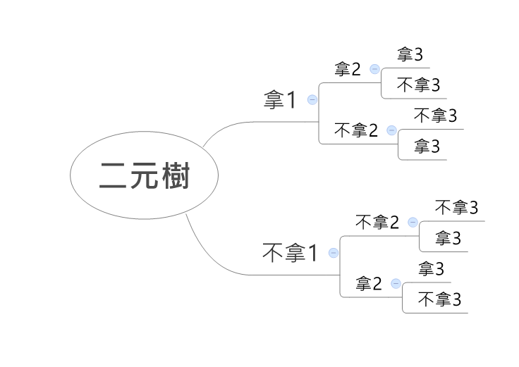

# 12137 - Johnny Johnny   

## Description
PaPa suspected that Johnny ate the sugar, yet Johnny said he hadn't eaten it.

Therefore, PaPa asked: " Telling lies? "

Johnny replied: " No PaPa. "

PaPa then demanded: " Open your mouth! "

Johnny laughed embarrassedly: " Ha Ha Ha!!! "

PaPa is so furious with Johnny telling lies, abd he punished Johnny to do some math.

PaPa gave Johnny n numbers a1 ~ an and a number k.

PaPa asked Johnny to calculate how many ways he could pick some numbers from a1 to an in order to make their sum equal to k?

For example: given n = 5 and numbers: { 1,2,3,3,3 }, and k = 3, the answer is 4.

(Note that although there are three identical "3", we still consider them as different indentities.) { (1, 2), (3), (3), (3) }

Johnny is a bad boy, so he commands you to do this for him!

> 給一串數字和目標和
  求可以將元素組合求和得出目標和的方法數


## Input
Input contains two lines.

First line contains two integer **n ( 1 <= n <= 20 ), k ( 1<=  k <=10^9)**

Second line contains n integer a1 ~ an (**1 <= ai <= 10^7** )
```
5 3
1 2 3 3 3
```
> n k
  a1 a2 ... an

## Output
Output only contains one integer that is sum of available ways to pick numbers, which summation is equal to k.

Remember to print \n at the end of output.
```
4
```

## 解題方向
1. 遞迴（目前和0~k+，目前位置0~19）
2. 最長20個元素
3. 每次遞迴：
    1. (和+這個位置元素，下個位置)  //有加，往下走
    2. (和，下個位置)              //不加，往下走
    
4. 終止條件：
    1. 目前和==k     回傳1表有可以(再加一定會超過，所以也不用再往下)
    2. 目前和>k      回傳0表不行(因為超過了)
    3. 目前位置=n    回傳0表不行(因為結束了)
5. 優化：
    1. 先排序(降冪)
    2. 有效切割分支

### 1905078 AC
```
#include <stdio.h>
#include <stdlib.h>
int n,k;
int A[20];//0~19

void input();
int compare(const void *,const void *);
void show();
int dfs(int,int);

int main(){

    input();
//    show();
    qsort(A,n,sizeof(A[0]),compare);
//    show();
    printf("%d\n",dfs(0,0));
    return 0;


}

int dfs(int sum,int p){
    /// Termination condition
    if(sum==k) return 1;
    if(sum>k||p==n) return 0;
    /// Recursive
    return (dfs(sum+A[p],p+1)+dfs(sum,p+1));
}

void input(){
    scanf("%d %d",&n,&k);
    for(int i=0;i<n;i++){
        scanf("%d",&A[i]);
    }
}
int compare(const void *a,const void*b){
    return -*(int *)a + *(int *)b;
}
void show(){
    for(int i=0;i<n;i++)
    printf("%d ",A[i]);
    printf("\n");
}
```
**優化效果** ：第6筆測資從 8ms 降低到 4ms
