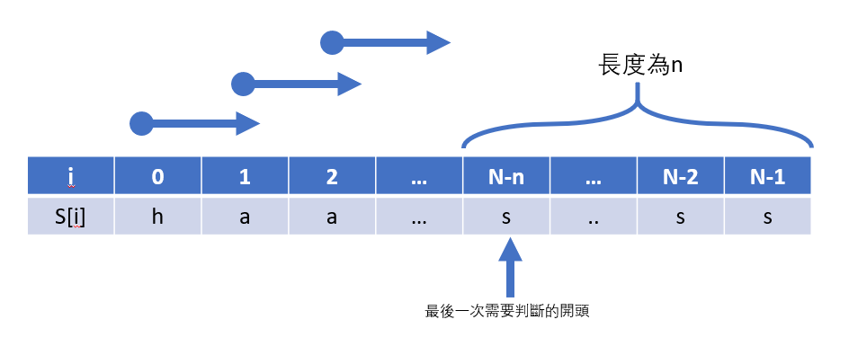
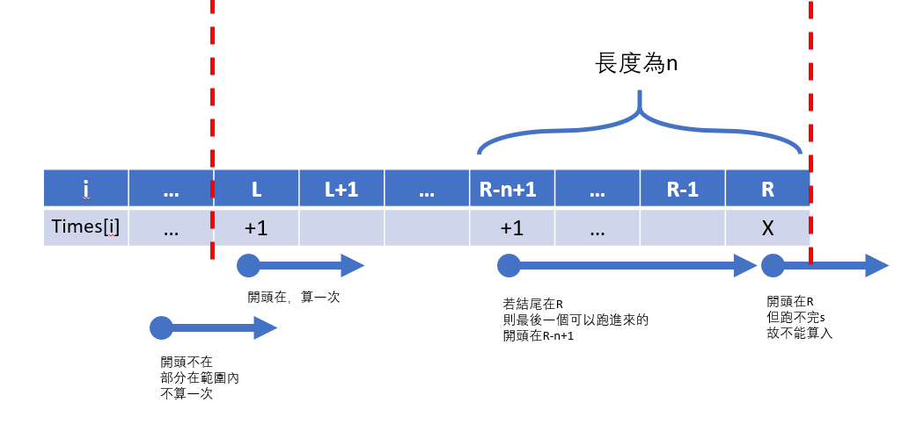

# 12140 - HaSaKi~   

## Description
"Death is like the wind, always by my side.", said by a famous streamer, Mr. Yasuoo.

Mr. Yasuoo is known for his skill "Slides up".

When Mr. Yasuoo slides across a string S, he will be asked t questions.

In each question, he should respond the number of occurrences of substring s, given a interval of [ l, r ].

Specifically, if the string S is "hasahasasaki" and the substring s is "sa", Mr. Yasuoo should answer 2 given the interval of [3, 9].

Since the interval [3~9]  indicates "sahasas",  the number of occurrences of substring "sa" is then 2.

Note that the index of string starts from 1 and contains only 'a' ~ 'z'.

Help Mr. Yasuoo to answer these questions before he starts feeding, ASAP!

⠄⠄⠄⠄⠄⠄⠄
 ⠄⠄⠄⠄⠄⠄⠄⠈⠉⠁⠈⠉⠉⠙⠿⣿⣿⣿⣿⣿
 ⠄⠄⠄⠄⠄⠄⠄⠄⣀⣀⣀⠄⠄⠄⠄⠄⠹⣿⣿⣿
 ⠄⠄⠄⠄⠄⢐⣲⣿⣿⣯⠭⠉⠙⠲⣄⡀⠄⠈⢿⣿
 ⠐⠄⠄⠰⠒⠚⢩⣉⠼⡟⠙⠛⠿⡟⣤⡳⡀⠄⠄⢻
 ⠄⠄⢀⣀⣀⣢⣶⣿⣦⣭⣤⣭⣵⣶⣿⣿⣏⠄⠄⣿
 ⠄⣼⣿⣿⣿⡉⣿⣀⣽⣸⣿⣿⣿⣿⣿⣿⣿⡆⣀⣿
 ⢠⣿⣿⣿⠿⠟⠛⠻⢿⠿⣿⣿⣿⣿⣿⣿⣿⣿⣶⣼
 ⠄⣿⣿⣿⡆⠄⠄⠄⠄⠳⡈⣿⣿⣿⣿⣿⣿⣿⣿⣿
 ⠄⢹⣿⣿⡇⠄⠄⠄⠄⢀⣿⣿⣿⣿⣿⣿⣿⣿⣿⣿
 ⠄⠄⢿⣿⣷⣨⣽⣭⢁⣡⣿⣿⠟⣩⣿⣿⣿⠿⠿⠟
 ⠄⠄⠈⡍⠻⣿⣿⣿⣿⠟⠋⢁⣼⠿⠋⠉⠄⠄⠄⠄
 ⠄⠄⠄⠈⠴⢬⣙⣛⡥⠴⠂⠄⠄⠄⠄⠄⠄⠄⠄⠄...
(the photo of the famous streamer)

> 給一串長的字串和短的目標以及固定範圍
  每次求範圍內出現短的字串的次數

## Input
Input should contain multiple lines.

First line indicates the string S ( 1<= length of S <= 10^3 )

Second line gives the substring s ( 1<= length of s <= 10^3 )

the string contains only lower case a~z.

Third line contains one integer t ( 1<= t <= 2*106 )

each of the following t lines gives two integer [l , r], where ( 1<= l <= r <= length of S)
```
hasahasasaki
sa
3
3 9
1 4
2 3
```
> 第一行為字串S
  第二行為子字串s
  第三行為問題數t
    接下來t行為序列區間 [l,r] 1~length of S

## Output
For each question, you are asked to print the the number of occurrences of substring s.

Your program should present a single '\n' at the end of output.
```
2
1
0
```
> t行

## 解題方向
1. 同一測資中S及s固定，t很大，應採先運算完整一次儲存答案陣列的方式
2. 輸入時儲存S及s長度分別為N,n
3. 對於S中每個元素作為s的開頭判斷一次，並做儲存
  1. 從0開始，最後一次到N-n就好，因為後面的長度已經小於n，不可能會再有完整s出現
  
  ~2. 將N-n以後的都令其為N-n之值~ 不會用到，見4.讀取次數的地方
  3. 判斷方式check(開頭i)：從i開始判斷n個是否全部相同
4. 讀取次數(l,r)
  1. 要求範圍內的次數
  2. 範圍內最後一個合法值-範圍前一個值
  3. times[r-n+1]-times[l-1]
  


## 解題記錄

### 1901989 (2/6)
```
#include <stdio.h>
char S[1000];
char s[1000];


int getline(char*);
void show(char*,int);
int Find(int,int,int);


int main(){
    freopen("12140_sampleIn.txt","r",stdin);
    int N,n;
    N=getline(S);
    n=getline(s);
    int t,l,r;
    scanf("%d",&t);
    for(int i=0;i<t;i++){
        scanf("%d %d",&l,&r);
        printf("%d\n",Find(l-1,r-1,n));

    }
    return 0;
}


int getline(char* Seq){
    char tmp;
    int i=0;
    while( (tmp=getchar())!='\n' ){
        Seq[i]=tmp;
        i++;
    }
    return i;
}

void show(char* Seq,int length){
    for(int i=0;i<length;i++){
        printf("%c",Seq[i]);
    }
}

int Find(int start,int end,int length){
    int sum=0;
    int check=0,j=0;
    for(int i=start;i<=end;i++){
        // judge each equal
        if(S[i]==s[j])
        {
            check++;
            j++;
        }
        else
        {
            check=0;
            j=0;
        }
        // count each all s
        if(check==length){
            sum++;
            check=0;
            j=0;
        }
    }
    //printf("%d\n",sum);
    return sum;
}
```
1. WA
2. AC 0ms
3. AC 216ms
4. TLE
5. TLE
6. TLE

### 19030005 (2/6)
```
#include <stdio.h>
char S[1000];//hasahasasaki
char s[1000];//sa
int times[1001];//to store how many times s in S 1~1000

int getline(char*);
void show(char*,int);
int Find(int,int,int);
void build(int,int);
int count_times(int l,int r,int n){
    if(n>1)
    {
        return (times[r]-times[l]);
    }
    else
    {
        //if (l==r) return (times[l]-times[l-1]);
        return (times[r]-times[l-1]);
    }

}


int main(){
    /// input S s
    freopen("12140_sampleIn.txt","r",stdin);
    int N,n;
    N=getline(S);
    n=getline(s);

    /// Build times array
    build(N,n);

    /// t queries
    int t,l,r;
    scanf("%d",&t);
    for(int i=0;i<t;i++){
        scanf("%d %d",&l,&r);
        //printf("%d\n",Find(l-1,r-1,n));
        printf("%d\n",count_times(l,r,n));
    }
    return 0;
}


int getline(char* Seq){
    char tmp;
    int i=0;
    while( (tmp=getchar())!='\n' ){
        Seq[i]=tmp;
        i++;
    }
    return i;
}

void show(char* Seq,int length){
    for(int i=0;i<length;i++){
        printf("%c",Seq[i]);
    }
}

int Find(int start,int end,int length){
    int sum=0;
    int check=0,j=0;
    // lengthg(s)=1
    if(length==1)
    {
        for(int i=start;i<=end;i++){
            if(S[i]==s[0]) sum++;
        }
        return sum;
    }

    for(int i=start;i<=end;i++){
        // judge each equal
        if(S[i]==s[j])
        {
            check++;
            j++;
        }
        else
        {
            check=0;
            j=0;
        }
        // count each all substring(s) in sting(S)
        if(check==length){
            sum++;
            check=0;
            j=0;
        }
    }
    //printf("%d\n",sum);
    return sum;
}
void build(int N,int n){
    for(int i=1;i<=N;i++){
        times[i]=Find(0,i-1,n);
    }
}
```
1. WA 0ms
2. AC 0ms
3. AC 112ms
4. WA 712ms
5. WA 692ms
6. WA 680ms
**問題點：** 每個開頭應該分開考慮，應該從開頭走陣列而不是用陣列作為開頭
  不然例如ssa的方式在sssa中可能會被考慮錯誤。(第三個s的時候因為不是a，於是歸零，下一次到a的時候卻從s[0]判斷起，會忽略掉)


### 1905747 AC
```
#include <stdio.h>
#include <stdbool.h>

char S[1000];   //hasahasasaki
char s[1000];   //sa
int N,n;        //length of S and s
int times[1000];//store how many times s in S from 0 to i

int getline(char* Seq);
bool check(int index);
void build();
int diff(int l,int r);


int main(){
    /// input S s
    freopen("12140_sampleIn.txt","r",stdin);
    N=getline(S);
    n=getline(s);

    /// Build times array
    build();

//    /// test times
//    for(int i=0;i<=(N-n);i++)
//        printf("%d",times[i]);
//    printf("\n");

    /// t queries
    int t,l,r;
    scanf("%d",&t);
    for(int i=0;i<t;i++){
        scanf("%d %d",&l,&r);
//        printf("%d %d\n",times[r-n+1],times[l-1]);
        printf("%d\n",diff(l-1,r-1));
    }
    return 0;
}


int getline(char* Seq){
    char tmp;
    int i=0;
    while( (tmp=getchar())!='\n' ){
        Seq[i]=tmp;
        i++;
    }
    return i;/// the length of this string
}


bool check(int index){
    for (int i=0;i<n;i++){
        if(S[index+i]!=s[i]) return false;
    }
    return true;
}

void build(){
    times[0]=check(0) ? 1:0 ;
    for (int i=1;i<=(N-n);i++){
        times[i]=times[i-1]+(check(i)?1:0);
    }
}

int diff(int l,int r){
    return (times[r-n+1]-times[l-1]);
}
```
重點：以頭記次，求差時右含左不含，右要位移n。
